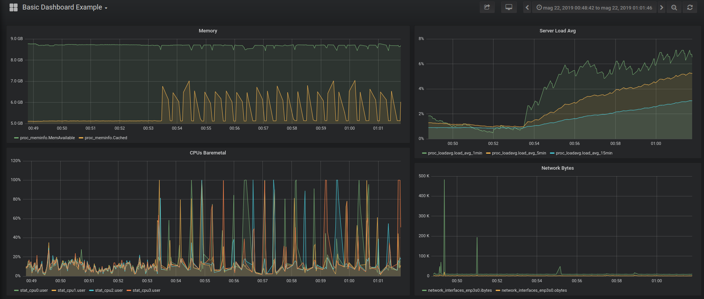

[](https://travis-ci.com/f18m/cmonitor "TravisCI status")
[](https://copr.fedorainfracloud.org/coprs/f18m/cmonitor/ "RPMs on Fedora COPR")

# cmonitor - lightweight container monitor

A **Docker, LXC, Kubernetes, database-free, lightweight container performance monitoring solution**, perfect for ephemeral containers
(e.g. containers used for DevOps automatic testing). Can also be used with InfluxDB, Prometheus and Grafana to monitor long-lived
containers in real-time.

The project is composed by 2 parts: 
1) a **lightweight agent** (80KB, native binary; no JVM, Python or other interpreters needed) to collect actual CPU/memory/disk statistics (Linux-only)
   and store them in a JSON file; this is the so-called `cmonitor-collector` utility;
2) some simple **Python tools to process the generated JSONs**; most important one is "cmonitor_chart" that turns the JSON into a self-contained HTML page
   using [Google Charts](https://developers.google.com/chart) to visualize all collected data.

The collector utility is a cgroup-aware statistics collector; cgroups (i.e. Linux Control Groups) are the basic technology used 
to create containers (you can [read more on them here](https://en.wikipedia.org/wiki/Cgroups)); this project is thus aimed at
monitoring your LXC/Docker/Kubernetes POD container performances. Of course the utility is generic and can still monitor physical servers.

This project supports only **Linux x86_64 architectures**.

Table of contents of this README:

- [cmonitor - lightweight container monitor](#cmonitor---lightweight-container-monitor)
  - [Features](#features)
  - [Yet-Another-Monitoring-Project?](#yet-another-monitoring-project)
  - [Supported Linux Kernels](#supported-linux-kernels)
  - [How to install](#how-to-install)
    - [RPM (for Fedora, Centos)](#rpm-for-fedora-centos)
    - [Debian package (for Debian, Ubuntu, etc)](#debian-package-for-debian-ubuntu-etc)
    - [Docker](#docker)
  - [How to build from sources](#how-to-build-from-sources)
    - [On Fedora, Centos](#on-fedora-centos)
    - [On Debian, Ubuntu](#on-debian-ubuntu)
  - [How to use](#how-to-use)
    - [Step 1: collect stats](#step-1-collect-stats)
    - [Step 2: plot stats collected as JSON](#step-2-plot-stats-collected-as-json)
    - [Usage scenarios and HTML result examples](#usage-scenarios-and-html-result-examples)
      - [Monitoring the baremetal server (no containers)](#monitoring-the-baremetal-server-no-containers)
      - [Monitoring your Docker container](#monitoring-your-docker-container)
      - [Monitoring your Kubernetes POD](#monitoring-your-kubernetes-pod)
    - [Connecting with InfluxDB and Grafana](#connecting-with-influxdb-and-grafana)
    - [Reference Manual](#reference-manual)
  - [Project History](#project-history)
  - [License](#license)

## Features

This project collects performance data sampling system-wide Linux statistic files (i.e. sampling `/proc`):

- per-CPU-core usage;
- memory usage (and memory pressure information);
- network traffic (PPS and MB/s or Mbps);
- disk load;
- average Linux load;

and can sample cgroup-specific (read: container-specific) statistics from `/sys/fs/cgroup` like:

- CPU usage as reported by the `cpuacct` (CPU accounting) cgroupv1 or by the  `cpu` cgroupv2;
- CPU throttling reported under `cpuacct` cgroup;
- CPU usage per-process and per-thread (useful for multithreaded application monitoring);
- memory usage and memory pressure information as reported by the `memory` cgroup;
- network usage measured by sampling the network interfaces associated to a cgroup network namespace;
- disk usage as reported by the `blkio` cgroup;

The collector of statistics can be configured to collect all or a subset of above statistics.
Moreover sub-second sampling is possible and up to 100 samples/sec can be collected in some cases (sampling all stats for a docker container
typically takes around 1msec). This allow to explore fast transients in CPU/memory/network usage.

Finally the project allows you to easily post-process collected data to:
* produce a **self-contained** HTML page which allows to visualize all the performance data easily using [Google Charts](https://developers.google.com/chart/);
* extract statistics information e.g. average/median/peak CPU usage and CPU throttling, average/median/peak memory usage etc.


## Yet-Another-Monitoring-Project?

You may be thinking "yet another monitoring project" for containers. Indeed there are already quite a few open source solutions, e.g.:

- [cAdvisor](https://github.com/google/cadvisor): a Google-sponsored utility to monitor containers
- [netdata](https://github.com/netdata/netdata): a web application targeting monitoring of large clusters
- [collectd](https://collectd.org/): a system statics collection daemon (not much container-oriented though)
- [metrics-server](https://github.com/kubernetes-sigs/metrics-server): the Kubernetes official metric server (Kubernetes only)

Almost all of these are very complete solutions that allow you to monitor swarms of containers, in real time.
The downside is that all these projects require you to setup an infrastructure (usually a time-series database) that collects
in real-time all the statistics and then have some powerful web platform (e.g. Graphana) to render those time-series.
All that is fantastic for **persistent** containers.

This project instead is focused on providing a database-free, lightweight container performance monitoring solution, 
perfect for **ephemeral** containers (e.g. containers used for DevOps automatic testing). The idea is much simpler:
1) you collect data for your container (or, well, your physical server) using a small collector software (written in C++ to
  avoid Java virtual machines, Python interpreters or the like!) that saves data on disk in JSON format;
2) whenever needed, the JSON can be either converted to a **self-contained** HTML page for human inspection or some kind of
   algorithm can be run to perform targeted analysis (e.g. imagine you need to search for time ranges where high-CPU usage was
   combined with high-memory usage or where instead CPU usage was apparently low but CPU was throttled due to cgroup limits);
3) the human-friendly HTML file, or the result of the analysis, can be then sent by email, stored in a tarball or as "artifact"
   of your CI/CD. The idea is that these post-processing results will have no dependencies at all with any infrastructure,
   so they can be consumed anywhere at anytime (in other words you don't need to make a time-series database available 24/7
   to go and dig performance results of your containers).

Moreover, cmonitor is the only tool (to the best of author's knowledge) that can collect CPU usage of multithreaded applications
with per-thread granularity.

## Supported Linux Kernels

Cmonitor version 2.0 and higher supports both cgroups v1 and cgroups v2.
This means that the `cmonitor-collector` utility can run on any Linux kernel regardless of its version and its boot options 
(since boot options may alter the cgroups technology in use).

Note that `cmonitor-collector` utility is currently unit-tested against:
* cgroups created by Docker/systemd on Centos 7 (Linux kernel v3.10.0), click [here](collector/src/tests/centos7-Linux-3.10.0-x86_64-docker/README.md) for more info
* cgroups created by Docker/systemd on Ubuntu 20.04 (Linux kernel v5.4.0), click [here](collector/src/tests/ubuntu20.04-Linux-5.4.0-x86_64-docker/README.md) for more info
* cgroups created by Docker/systemd on Fedora 35 (Linux kernel v5.14.17), click [here](collector/src/tests/fedora35-Linux-5.14.17-x86_64-docker/README.md) for more info

Other kernels will be tested in near future. Of course pull requests are welcome to extend coverage.

Regarding cgroup driver, `cmonitor-collector` is tested against both the `cgroupfs` driver (used e.g. by Docker to create cgroups
for containers using cgroups v1) and the `systemd` driver (which creates cgroups for the baremetal environment, not for containers).
To find out which cgroup driver and which cgroup version you are using when launching e.g. Docker containers you can run:

```
docker info | grep -i cgroup
```

You may also be interested in  this article https://lwn.net/Articles/676831/ for more details on the docker vs systemd friction in Linux world.


## How to install


### RPM (for Fedora, Centos)

You can get started with cmonitor by installing a native RPM.
This project uses [COPR](https://copr.fedorainfracloud.org/coprs/f18m/cmonitor/) repository for maintaining
always up-to-date RPMs for Fedora and Centos distributions. Just run:

```
yum install -y yum-plugin-copr
yum copr enable -y f18m/cmonitor
yum install -y cmonitor-collector cmonitor-tools
```

(or use `dnf` if you prefer).

Note that the RPM `cmonitor-collector` has no dependencies from Python and has very small set of dependencies (GNU libc and few others)
so can be installed easily everywhere. The RPM `cmonitor-tools` instead requires Python3.


### Debian package (for Debian, Ubuntu, etc)

You can get started with cmonitor by installing it as a Debian package.
The debian packages are built using [Ubuntu private PPA service](https://launchpad.net/~francesco-montorsi/+archive/ubuntu/cmonitor). 
Just run:

```
add-apt-repository ppa:francesco-montorsi/cmonitor
apt-get install cmonitor-collector cmonitor-tools
```

Note that the debian package `cmonitor-collector` has no dependencies from Python and has very small set of dependencies (GNU libc and few others)
so can be installed easily everywhere. The debian package `cmonitor-tools` instead requires Python3.

WARNING: I'm having troubles maintaining both the RPM, docker and Ubuntu packaging for this project, so typically the Ubuntu (.deb) package is
updated only later, when I have time. If you want to test very latest cmonitor release as .deb please let me know, I might be able to push the latest
release in my PPA.


### Docker

Alternatively to native packages, you can use `cmonitor_collector` utility as a Docker:

```
docker run -d \
    --rm \
    --name=cmonitor-baremetal-collector \
    --network=host \
    --pid=host \
    --volume=/sys:/sys:ro \
    --volume=/etc/os-release:/etc/os-release:ro \
    --volume=$(pwd):/perf:rw \
    f18m/cmonitor:latest \
    --sampling-interval=1  ...
```

which runs the Docker image for this project from [Docker Hub](https://hub.docker.com/r/f18m/cmonitor).
Note that the Dockerfile entrypoint is `cmonitor_collector` and thus any [supported CLI option](#reference-manual) can be provided
at the end of the `docker run` command.
The volume mount of `/etc/os-release` and the `--network=host` option are required to allow `cmonitor_collector` to correctly identify the real host
being monitored (otherwise `cmonitor_collector` reports the randomly-generated hash by Docker for the hostname).
The `--pid=host` option is required to allow `cmonitor_collector` to monitor processes generated by other containers.
Finally, the volume mount of `/sys` exposes all the cgroups of baremetal into the `cmonitor_collector` docker and thus enables the collector
utility to access the stats of all other running containers; this is required by similar tools as well like [cAdvisor](https://github.com/google/cadvisor).


## How to build from sources

### On Fedora, Centos

First of all, checkout this repository on your Linux box using git or decompressing a tarball of a release.
Then run:

```
sudo dnf install -y gcc-c++ make gtest-devel fmt-devel
make all -j
make test                                    # optional step to run unit tests
sudo make install DESTDIR=/usr/local BINDIR=bin   # to install in /usr/local/bin
```

### On Debian, Ubuntu

First of all, checkout this repository on your Linux box using git or decompressing a tarball of a release.
Then run:

```
sudo apt install -y libgtest-dev libbenchmark-dev python3 libfmt-dev g++
make all -j
make test                                    # optional step to run unit tests
sudo make install DESTDIR=/usr/local BINDIR=bin   # to install in /usr/local/bin
```


## How to use

### Step 1: collect stats

The RPM/Debian packages "cmonitor-collector" install a single utility, named `cmonitor_collector`.
It can be launched as simply as:

```
cmonitor_collector --sampling-interval=3 --output-directory=/home
```

(on baremetal) or as a Docker:

```
docker run -d \
    --rm \
    --name=cmonitor-baremetal-collector \
    --network=host \
    --pid=host \
    --volume=/sys:/sys:ro \
    --volume=/etc/os-release:/etc/os-release:ro \
    --volume=/home:/perf:rw \
    f18m/cmonitor:latest \
    --sampling-interval=1  ...
```

to produce in the `/home` folder a JSON with CPU/memory/disk/network stats for the container
sampling all supported performance statistics every 3 seconds.

Once the JSON is produced, next steps are either:

- inject that JSON inside InfluxDB (mostly useful for **persistent** containers that you want to monitor in real-time);
  see section "Connecting with InfluxDB and Grafana" below;
- or use the `cmonitor_chart` utility to convert that JSON into a self-contained HTML file (mostly useful for **ephemeral** containers);
  see below for practical examples.

See [supported CLI option](#reference-manual) section for complete list of accepted options.


### Step 2: plot stats collected as JSON

To plot the JSON containing the collected statistics, simply launch the `cmonitor_chart` utility installed together
with the RPM/Debian package, with the JSON collected from `cmonitor_collector`:

```
cmonitor_chart --input=/path/to/json-stats.json --output=<optional HTML output filename>
```

Note that to save space/bandwidth you can also gzip the JSON file and pass it gzipped directly to `cmonitor_chart`.


### Usage scenarios and HTML result examples


#### Monitoring the baremetal server (no containers)

If you want to monitor the performances of an entire server (or worker node in Kubernetes terminology), you can either:
a) install `cmonitor_collector` as RPM or APT package following instructions or
b) use `cmonitor_collector` as a Docker;
See [How to install](#how-to-install) for more information.

Example results:

1) [baremetal1](https://f18m.github.io/cmonitor/examples/baremetal1.html): 
   example of graph generated with the performance stats collected from a physical (baremetal) server by running `cmonitor_collector` installed as RPM; 
   note that despite the absence of any kind of container, the `cmonitor_collector` utility (like just any other software in 
   modern Linux distributions) was running inside the default "user.slice" cgroup and collected both the stats of that cgroup 
   and all baremetal stats (which in this case mostly coincide since the "user.slice" cgroup contains almost all running processes of the server);
   
2) [baremetal2](https://f18m.github.io/cmonitor/examples/baremetal2.html): 
   This is a longer example of collected statistics (results in a larger file, may take some time to download) generated
   with 9 hours of performance stats collected from a physical server running Centos7 and with 56 CPUs (!!); 
   the `cmonitor_collector` utility was installed as RPM and running inside the default "user.slice" cgroup so both "CGroup" and "Baremetal"
   graphs are present;

3) [docker_collecting_baremetal_stats](https://f18m.github.io/cmonitor/examples/docker-collecting-baremetal-stats.html): 
   example of graph generated with the performance stats collected from a physical server from `cmonitor_collector` Docker container;
   in this case cgroup stat collection was explicitely disabled so that only baremetal performance graphs are present;
   see [Docker installation](#docker) information as reference how the docker was started.


#### Monitoring your Docker container

In this case you can simply install cmonitor as RPM or APT package following instructions in [How to install](#how-to-install)
and then launch the `cmonitor_collector` utility as any other Linux daemon, specifying the name of the cgroup associated with
the docker container to monitor.
Finding out the cgroup associated with a Docker container can require some detailed information about your OS / runtime configuration;
for example you should know whether you're using cgroups v1 or v2 and which Docker cgroup driver are you using (cgroupfs or systemd);
please see the [official Docker page](https://docs.docker.com/config/containers/runmetrics/#find-the-cgroup-for-a-given-container)
for more details.
In the following example a [Redis](https://hub.docker.com/_/redis) docker container is launched with the name 'userapp' and its
CPU, memory, network and disk usage are monitored launching a `cmonitor_collector` instance:

```
docker run --name userapp --detach redis:latest

DOCKER_ID=$(docker ps -aq --no-trunc -f "name=userapp")

CGROUP_NAME=docker/${DOCKER_ID}                       # when 'cgroupfs' driver is in use
CGROUP_NAME=system.slice/docker-${DOCKER_ID}.scope    # when 'systemd' driver is in use

# here we exploit the following fact: the cgroup of each Docker container 
# is always named 'docker/container-ID'... at least when using Moby engine
cmonitor_collector \
   --num-samples=until-cgroup-alive \
   --cgroup-name=${CGROUP_NAME} \
   --collect=cgroup_threads,cgroup_cpu,cgroup_memory,cgroup_network --score-threshold=0 \
   --custom-metadata=cmonitor_chart_name:userapp \
   --sampling-interval=3 \
   --output-filename=docker-userapp.json
```

Alternatively the Redis Docker container (or any other one) can be monitored from `cmonitor_collector` running as a Docker itself:

```
docker run -d \
    --rm \
    --name=cmonitor-collector \
    --network=host \
    --pid=host \
    --volume=/sys:/sys:ro \
    --volume=/etc/os-release:/etc/os-release:ro \
    --volume=/home:/perf:rw \
    f18m/cmonitor:latest \
   --num-samples=until-cgroup-alive \
   --cgroup-name=${CGROUP_NAME} \
   --collect=cgroup_threads,cgroup_cpu,cgroup_memory,cgroup_network --score-threshold=0 \
   --custom-metadata=cmonitor_chart_name:userapp \
   --sampling-interval=3 \
   --output-filename=docker-userapp.json
```

See [Docker usage](#docker) paragraph for more info about the "docker run" options required.
See example #4 below to view the results produced by using the `cmonitor_collector` Docker with the command above.

Example results:

1) [docker_userapp](https://f18m.github.io/cmonitor/examples/docker-userapp.html): example of the chart generated by monitoring
   from the baremetal a simple Redis docker simulating a simple application, doing some CPU and I/O. In this example the 
   `--collect=cgroup_threads` is further used to show Redis CPU usage by-thread.

2) [docker_stress_test_cpu](https://f18m.github.io/cmonitor/examples/docker-stress-test-cpu.html): example of the chart generated
   by monitoring from the baremetal a [stress-ng](https://hub.docker.com/r/alexeiled/stress-ng/) Docker with a CPU limit set. 
   This example shows how cmonitor will report "CPU throttling" and how useful it is to detect cases where a Docker is trying to
   use too much CPU.

3) [docker_stress_test_memory](https://f18m.github.io/cmonitor/examples/docker-stress-test-mem.html): example of the chart generated
   by monitoring from the baremetal a [stress-ng](https://hub.docker.com/r/alexeiled/stress-ng/) Docker with a MEMORY limit set. 
   This example shows how cmonitor will report "Memory allocation failures" and how useful it is to detect cases where a Docker is trying to
   use too much memory.

4) [docker_collecting_docker_stats](https://f18m.github.io/cmonitor/examples/docker-collecting-docker-stats.html): example of the chart generated
   by monitoring from  `cmonitor_collector` Docker a Redis Docker.
   This example shows how cmonitor is able to run as a Docker-monitoring-other-Dockers.


#### Monitoring your Kubernetes POD

In this case you can simply install cmonitor as RPM or APT package following instructions in [How to install](#how-to-install)
on all the worker nodes where Kubernetes might be scheduling the POD you want to monitor.
Then, you can launch the `cmonitor_collector` utility as any other Linux daemon, specifying the name of the cgroup associated
with the Kubernetes POD (or more precisely, associated with one of the containers inside the Kubernetes POD, in case it contains
also sidecar containers).
Finding the name of the cgroup associated with your POD is tricky. It depends on the specific Kubernetes Container Runtime Interface
(CRI), but the following example shows a generic-enough procedure:

```
PODNAME=<your-pod-name>
CONTAINERNAME=<main-container-name>
CONTAINERID=$(kubectl get pod ${PODNAME} -o json | jq -r ".status.containerStatuses[] | select(.name==\"${CONTAINERNAME}\") | .containerID" | sed  's@containerd://@@')
FULL_CGROUP_NAME=$(find /sys/fs/cgroup -name ${CONTAINERID} | head -1 |sed 's@/sys/fs/cgroup/memory/@@')

cmonitor_collector \
   --num-samples=until-cgroup-alive \
   --cgroup-name=${FULL_CGROUP_NAME} \
   --collect=cgroup_threads,cgroup_cpu,cgroup_memory --score-threshold=0 \
   --custom-metadata=cmonitor_chart_name:${PODNAME} \
   --sampling-interval=3 \
   --output-filename=pod-performances.json
```


### Connecting with InfluxDB and Grafana

The `cmonitor_collector` can be connected to an [InfluxDB](https://www.influxdata.com/) deployment to store collected data (this can happen
in parallel to the JSON default storage). This can be done by simply providing the IP and port of the InfluxDB instance when launching
the collector:

```
cmonitor_collector --remote-ip 1.2.3.4 --remote-port 8086 --remote influxdb
```

The InfluxDB instance can then be used as data source for graphing tools like [Grafana](https://grafana.com/)
which allow you to create nice interactive dashboards like the following one:



You can also play with the [live dashboard example](https://snapshot.raintank.io/dashboard/snapshot/JdX4hDukUCGuJHsXymM86KbFO5LC9GrY?orgId=2&from=1558478922136&to=1558479706448)

To setup easily and quickly the chain "cmonitor_collector-InfluxDB-Grafana" you can checkout the repo of this project and run:

```
make -C examples regen_grafana_screenshots
```

which uses Docker files to deploy a temporary setup and fill the InfluxDB with 10minutes of data collected from the baremetal.


### Connecting with Prometheus and Grafana

The `cmonitor_collector` can be connected to an [Prometheus](https://prometheus.io/) instance where the collected metrics gets exposed to(this can happen
in parallel to the JSON default storage). This can be done by simply providing the IP and port for the Prometheus when launching the collector.

To support prometheus [prometheus-cpp](https://github.com/jupp0r/prometheus-cpp) client library needs to be installed.

`conan`:
Conan package manager contains prometheus-cpp package as well in [ConanCenter](https://conan.io/center/prometheus-cpp) repository

```
manual steps:
 sudo pip3 install conan
 sudo conan profile new default --detect
 sudo conan profile update settings.compiler.libcxx=libstdc++11 default
 sudo conan install conanfile.txt --build=missing

conanfile.txt:
[requires]
  prometheus-cpp/1.0.0@

[options]
  prometheus-cpp:shared=True                     # default is True
  prometheus-cpp:with_pull=True                  # default is True
  prometheus-cpp:with_push=False                 # default is False
  prometheus-cpp:with_compression=False          # default is False
  prometheus-cpp:fPIC=True                       # default is True

[imports]
  lib, *.so* -> /usr/lib64
  include, * -> /usr/include
```

```
build:
 make PROMETHEUS_SUPPORT=1
```

```
usage:
cmonitor_collector \
   --num-samples=until-cgroup-alive \
   --cgroup-name=${FULL_CGROUP_NAME} \
   --collect=cgroup_threads,cgroup_cpu,cgroup_memory --score-threshold=0 \
   --custom-metadata=cmonitor_chart_name:${PODNAME} \
   --sampling-interval=3 \
   --output-filename=pod-performances.json \
   --remote-ip 10.1.2.3 --remote-port 9092 --remote prometheus
```

Later Grafana can be configured to provide a seamless way to connect to the Prometheus as a data source.

### Reference Manual

The most detailed documentation on how to use cmonitor tool is available from `--help` option:

```
cmonitor_collector: Performance stats collector outputting JSON format.
List of arguments that can be provided follows:

Data sampling options
  -s, --sampling-interval=<REQ ARG>     Seconds between samples of data (default 60 seconds). Minimum value is 0.01sec, i.e. 10msecs.
  -c, --num-samples=<REQ ARG>           Number of samples to collect; special values are:
                                           '0': means forever (default value)
                                           'until-cgroup-alive': until the selected cgroup is alive
  -k, --allow-multiple-instances        Allow multiple simultaneously-running instances of cmonitor_collector on this system.
  -F, --foreground                      Stay in foreground.
  -C, --collect=<REQ ARG>               Collect specified list of performance stats. Available performance stats are:
                                          'cpu': collect per-core CPU stats from /proc/stat
                                          'memory': collect memory stats from /proc/meminfo, /proc/vmstat
                                          'disk': collect disk stats from /proc/diskstats
                                          'network': collect network stats from /proc/net/dev
                                          'cgroup_cpu': collect CPU stats from the 'cpuacct' cgroup
                                          'cgroup_memory': collect memory stats from 'memory' cgroup
                                          'cgroup_network': collect network statistics by interface for the network namespace of the cgroup
                                          'cgroup_processes': collect stats for each process inside the 'cpuacct' cgroup
                                          'cgroup_threads': collect stats for each thread inside the 'cpuacct' cgroup
                                          'all_baremetal': the combination of 'cpu', 'memory', 'disk', 'network'
                                          'all_cgroup': the combination of 'cgroup_cpu', 'cgroup_memory', 'cgroup_processes'
                                          'all': the combination of all previous stats (this is the default)
                                        Note that a comma-separated list of above stats can be provided.
  -e, --deep-collect                    Collect all available details about the stats families enabled by --collect.
                                        By default, for each family, only the stats that are used by the 'cmonitor_chart' companion utility
                                        are collected. With this option a more detailed but larger JSON / InfluxDB / Prometheus data stream is produced.
  -g, --cgroup-name=<REQ ARG>           If cgroup sampling is active (--collect=cgroups*), this option allows to provide explicitly the name of
                                        the cgroup to monitor. If 'self' value is passed (the default), the statistics of the cgroups where 
                                        cmonitor_collector runs will be collected. Note that this option is mostly useful when running 
                                        cmonitor_collector directly on the baremetal since a process running inside a container cannot monitor
                                        the performances of other containers.
  -t, --score-threshold=<REQ ARG>       If cgroup process/thread sampling is active (--collect=cgroup_processes/cgroup_threads) use the provided
                                        score threshold to filter out non-interesting processes/threads. The 'score' is a number that is linearly
                                        increasing with the CPU usage. Defaults to value '1' to filter out all processes/threads having zero CPU
                                        usage. Use '0' to turn off filtering by score.
  -M, --custom-metadata=<REQ ARG>       Allows to specify custom metadata key:value pairs that will be saved into the JSON output (if saving data
                                        locally) under the 'header.custom_metadata' path. See usage examples below.
                                        
Options to save data locally
  -m, --output-directory=<REQ ARG>      Program will write output files to provided directory (default cwd).
  -f, --output-filename=<REQ ARG>       Name the output files using provided prefix instead of defaulting to the filenames:
                                                hostname_<year><month><day>_<hour><minutes>.json  (for JSON data)
                                                hostname_<year><month><day>_<hour><minutes>.err   (for error log)
                                        Use special prefix 'stdout' to indicate that you want the utility to write on stdout.
                                        Use special prefix 'none' to indicate that you want to disable JSON generation.
  -P, --output-pretty                   Generate a pretty-printed JSON file instead of a machine-friendly JSON (the default).
                                        
Options to stream data remotely
  -i, --remote-ip=<REQ ARG>             IP address or hostname of the InfluxDB instance to send measurements to;
                                        cmonitor_collector will use a database named 'cmonitor' to store them.
                                        This can be used to set the hostname for Prometheus instance.
  -p, --remote-port=<REQ ARG>           Port to be used by InfluxDB or Prometheus instance.
  -X, --remote-secret=<REQ ARG>         Set the InfluxDB collector secret (by default use environment variable CMONITOR_SECRET).
                                        
  -D, --remote-dbname=<REQ ARG>         Set the InfluxDB database name.

Options to set remote
  -r, --remote=<REQ ARG>                Set the target influxdb|prometheus.
                                        
Other options
  -v, --version                         Show version and exit
  -d, --debug                           Enable debug mode; automatically activates --foreground mode
  -h, --help                            Show this help

Examples:
    1) Collect data from OS every 5 mins all day:
        cmonitor_collector -s 300 -c 288 -m /home/perf
    2) Collect data from a docker container:
        DOCKER_NAME=your_docker_name
        DOCKER_ID=$(docker ps -aq --no-trunc -f "name=$DOCKER_NAME")
        cmonitor_collector --allow-multiple-instances --num-samples=until-cgroup-alive 
                        --cgroup-name=docker/$DOCKER_ID --custom-metadata='cmonitor_chart_name:$DOCKER_NAME'
    3) Use the defaults (-s 60, collect forever), saving to custom file in background:
        cmonitor_collector --output-filename=my_server_today
    4) Crontab entry:
        0 4 * * * /usr/bin/cmonitor_collector -s 300 -c 288 -m /home/perf
    5) Crontab entry for pumping data to an InfluxDB:
        * 0 * * * /usr/bin/cmonitor_collector -s 300 -c 288 -i admin.acme.com -p 8086
    6) Pipe into 'myprog' half-a-day of sampled performance data:
        cmonitor_collector --sampling-interval=30 --num-samples=1440 --output-filename=stdout --foreground | myprog

NOTE: this is the cgroup-aware fork of original njmon software (see https://github.com/f18m/cmonitor)
```


## Project History

This project started as a fork of [Nigel's performance Monitor for Linux](http://nmon.sourceforge.net), adding cgroup-awareness;
but it has quickly evolved to a point where it shares very little code pieces with the original `njmon` tool.

Some key differences now include:
 - cgroup-aware: several performance cgroup stats are collected by `cmonitor_collector` and plotted by `cmonitor_chart`
 - more command-line options for `cmonitor_collector`;
 - HTML page generated by `cmonitor_chart` differently organized;
 - `cmonitor_collector` is able to connect to InfluxDB directly and does not need intermediate Python scripts to transform
   from JSON streamed data to InfluxDB-compatible stream.

This fork supports only Linux x86_64 architectures; support for AIX/PowerPC (present in original `nmon`) has been dropped.

- Original project: [http://nmon.sourceforge.net](http://nmon.sourceforge.net)
- Other forks: [https://github.com/axibase/nmon](https://github.com/axibase/nmon)


## License

Just like the [original project](http://nmon.sourceforge.net), this project is licensed under [GNU GPL 2.0](LICENSE)
